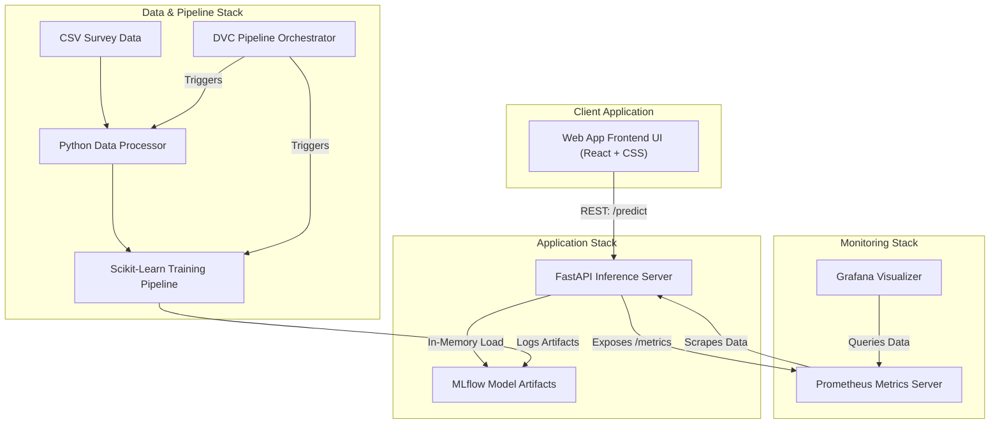

# Application Architecture Diagram

## Description of Blocks

- **Web App Frontend UI**: Highly aesthetic, glassmorphic UI avoiding standard Tailwind limits, routing variables to the backend transparently. 
- **FastAPI Inference Server**: Loads localized `.pkl` models via MLflow libraries matching the DVC output and executes prediction schemas asynchronously.
- **Monitoring Stack**: Prometheus polls the FastAPI endpoint exposing error occurrences and prediction outcomes recursively. Grafana links sequentially as an aggregator.
- **DVC/Data Engine Stack**: Handles pipeline reproduction without redundant retraining schedules, strictly logging parameter hashes against code outputs.
